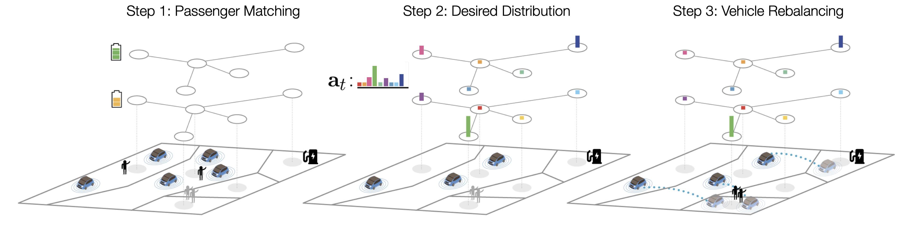

# Real-time Control of Electric AMoD via Graph Reinforcement Learning
Official implementation of [Real-time Control of Electric Autonomous Mobility-on-Demand Systems via Graph Reinforcement Learning](https://arxiv.org/abs/2311.05780)

</td> <br/>

## Prerequisites

You will need to have a working Gurobi Optimizer installation. If you are a student or academic, Gurobi Optimization provides Gurobi Optimizer at no cost. You can find more information [here](https://www.gurobi.com/downloads/end-user-license-agreement-academic/).

To install all required dependencies, run:
```
pip install -r requirements.txt
```

## Contents

* `src/algos/pax_flows_solver.py`: Gurobi Python formulation of the Passenger Matching problem (Section IV-A Step 1 in the paper).
* `src/algos/sac.py`: PyTorch implementation of SAC-GNN for determining Desired Distribution (Section IV-A Step 2 in the paper).
* `src/algos/reb_flows_solver.py`: Gurobi Python formulation of the Vehicle Rebalancing problem (Section IV-A Step 3 in the paper).
* `src/envs/amod_env.py`: E-AMoD simulator.
* `src/misc/`: helper functions.
* `data/`: json and npy files for NYC experiments.
* `checkpoint/`: directory for saved SAC-GNN model weights.

## Examples

To train and test an agent, `main.py` accepts the following key arguments:
```
arguments:
  --spatial_nodes N     number of spatial nodes (default: 5)
  --city N              city (default: NY)
  --scratch SCRATCH     whether to start training from scratch
  --resume RESUME       whether to resume training
  --test TEST           activates test mode for agent evaluation
  --max_episodes N      number of episodes to train agent (default: 9k)
  --T N                 Time horizon (default: 48)
  --run_id RUN_ID       defines unique ID for run
```
To see all arguments, run:
```
python main.py --help
```

### Testing an agent
Pretrained agents for NYC are available in the `checkpoint/` directory.
To evaluate a pretrained agent with run_id X (e.g., 99) run the following:
```
python main.py --spatial_nodes 5 --T 48 --city NY --max_episodes 9000 --test True --run_id 99
```

### Training an agent
1. To train a new agent from scratch with run_id X (e.g., 123) run the following:
```
python main.py --spatial_nodes 5 --T 48 --city NY --max_episodes 9000 --scratch True --run_id 123
```
**Important**: make sure to use a unique run_id to avoid overwriting existing checkpoints.

2. To resume training of an agent with run_id X (e.g., 123) run the following:
```
python main.py --spatial_nodes 5 --T 48 --city NY --max_episodes 9000 --resume True --run_id 123
```


## Credits
This work was conducted as a joint effort by [Aaryan Singhal*](https://www.aaryan-singhal.com/), [Daniele Gammelli*](https://scholar.google.it/citations?user=C9ZbB3cAAAAJ), [Justin Luke*](https://scholar.google.com/citations?user=G-_Za4EAAAAJ), [Karthik Gopalakrishnan*](https://scholar.google.com/citations?user=Tt2MJQsAAAAJ), Dominik Helmreich', and [Marco Pavone*](https://web.stanford.edu/~pavone/), at ETH Zurich' and Stanford University*. 

## Reference
```
@inproceedings{SinghalGammelliEtAl2024,
  author = {Singhal, A. and Gammelli, D. and Luke, J. and Gopalakrishnan, K. and Helmreich, D. and Pavone, M.},
  title = {Real-time Control of Electric Autonomous Mobility-on-Demand Systems via Graph Reinforcement Learning},
  booktitle = {{European Control Conference}},
  year = {2024},
  address = {Stockholm, Sweden},
  note = {In press},
  url = {https://arxiv.org/abs/2311.05780}
}
```

----------
In case of any questions, bugs, suggestions or improvements, please feel free to contact Daniele Gammelli at gammelli@stanford.edu.
